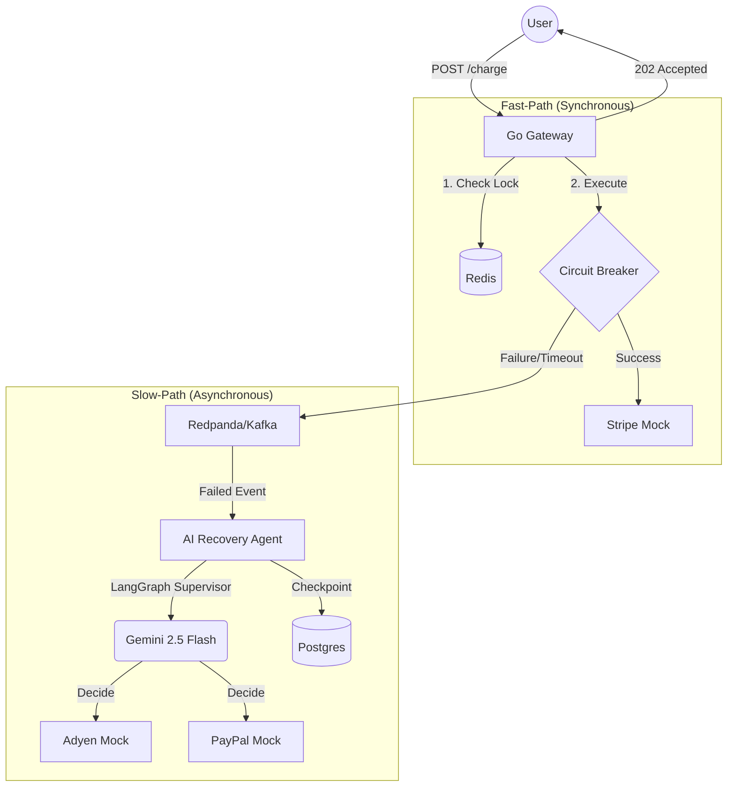

# 🛡️ Aegis-Pay: AI-Orchestrated Self-Healing Payment Gateway

**A high-fidelity architectural simulation demonstrating senior-level mastery in Go, distributed systems, and AI orchestration with LangGraph.**

[](https://golang.org/)
[](https://www.python.org/)
[](https://ai.google.dev/)
[](https://redpanda.com/)

---

## 📖 Overview

Aegis-Pay is a production-grade prototype of a resilient payment gateway. It solves the "Stripe is down" problem by implementing a **Fast-Path / Slow-Path** architecture. 

When a primary payment provider fails, Aegis-Pay doesn't just return an error; it uses **Event-Driven Architecture (EDA)** to hand off the transaction to a **LangGraph-powered AI Recovery Agent**. The agent intelligently analyzes the failure and routes the recovery through optimal backup providers—ensuring zero revenue loss.

## 🏗️ Architecture



## 🚀 Key Features

### ⚡ Performance & Resilience (The Go Gateway)
- **Idempotency Shield:** Prevents double-charging using distributed Redis locking (`SetNX`).
- **Circuit Breaker Pattern:** Uses `gobreaker` to detect provider failures and "fail-fast," protecting system resources during outages.
- **Graceful Shutdown:** Implements OS signal handling to ensure active transactions finish before process exit.

### 🧠 Self-Healing Intelligence (The AI Recovery Agent)
- **LangGraph Orchestration:** A stateful "Supervisor Agent" pattern that manages specialized worker nodes for different providers.
- **Strategic Routing:** Gemini 2.5 Flash analyzes error codes and transaction values to select the most cost-effective recovery path.
- **Durable Checkpointing:** Every AI decision is persisted in Postgres, allowing the agent to resume recovery even after a crash.

### 🛠️ Infrastructure-as-Code
- Full developer environment containerized via **Docker Compose**.
- High-fidelity **Chaos Mocks** built with FastAPI to simulate timeouts, 403s, and 402 errors.

## 🛠️ Tech Stack

- **Backend:** Go (Fiber v2), Python 3.10+ (FastAPI)
- **AI:** LangGraph, LangChain, Google Gemini 2.5 Flash
- **Data:** Redis (Cache/Locks), Postgres (State Storage)
- **Messaging:** Redpanda (Kafka-compatible event bus)
- **Observability:** Structured logging with state transitions

## 🚦 Getting Started

### 1. Prerequisites
- Docker & Docker Compose
- Go 1.24+
- Python 3.10+
- [Google Gemini API Key](https://aistudio.google.com/app/apikey)

### 2. Environment Setup
```bash
cp .env.example .env
# Update GEMINI_API_KEY in .env
```

### 3. Launch Infrastructure
```bash
docker-compose up -d
```

### 4. Run the Gateway
```bash
go run cmd/gateway/main.go
```

### 5. Run the AI Agent
```bash
cd recovery-agent
pip install -r requirements.txt
export PYTHONPATH=.
python main.py
```

## 🧪 Testing the "Self-Healing"
Send a transaction that forces a Stripe timeout (Amount > 1000):
```bash
curl -X POST http://localhost:8080/charge \
  -H "Idempotency-Key: demo-123" \
  -H "Content-Type: application/json" \
  -d '{"amount": 1500, "currency": "USD", "user_id": "vip_user"}'
```
**Expectation:**
1. The Gateway returns `202 Accepted`.
2. The AI Agent logs show Gemini choosing the **AdyenProcessor** for recovery.
3. The transaction is successfully processed in the background.

---

## ⚖️ Disclaimer
This project is an **architectural prototype** intended for educational and brand-building purposes. It demonstrates production-level patterns but is not intended for real-world financial transactions without further security hardening and compliance (PCI-DSS) auditing.
