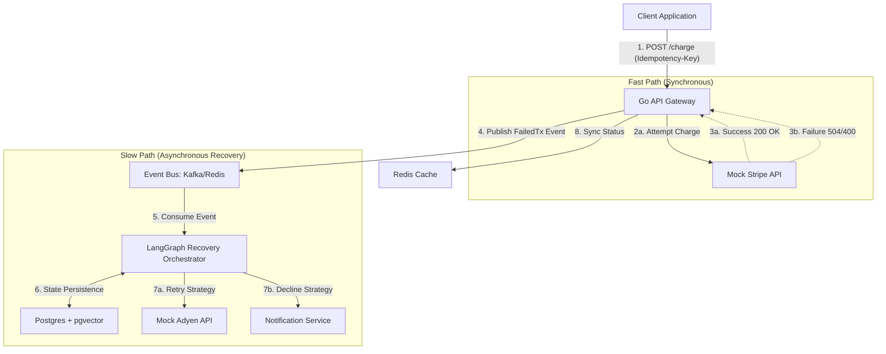

# Aegis-Pay: AI-Orchestrated Self-Healing Payment Gateway
**Status:** Draft
**Author:** Ekant Bajaj
**Date:** April 2026

## 1. Executive Summary
Aegis-Pay is a highly resilient, distributed payment gateway architecture designed to mitigate third-party API failures using agentic AI. While traditional gateways rely on static retry logic (exponential backoff) or rigid failover matrices, Aegis-Pay routes failed transactions to a LangGraph-powered **Recovery Orchestrator**. This orchestrator analyzes the raw provider error, user context, and current system health to dynamically determine the optimal recovery strategy (e.g., retry on a premium provider, gracefully decline, or escalate for manual review).

This project demonstrates expertise in:
*   **High-Scale Distributed Systems:** Golang, Idempotency, Circuit Breaking.
*   **Event-Driven Architecture:** Kafka / Redis PubSub for decoupling the fast-path from the slow-path.
*   **Advanced AI Orchestration:** LangGraph (Supervisor/Worker pattern) with Postgres persistence for stateful, long-running recovery decisions.

## 2. Architecture Overview

The system consists of three primary pillars communicating asynchronously.

### 2.1 Component Diagram


### 2.2 Core Components

#### A. The Gateway (Golang)
*   **Responsibilities:** High-throughput entry point, validation, and synchronous routing.
*   **Idempotency Engine:** Uses Redis to store request hashes mapped to `Idempotency-Key` headers. Ensures a client retry during a timeout doesn't result in a double charge.
*   **Circuit Breaker:** Protects downstream providers. If MockStripe latency spikes, the breaker opens, and transactions immediately failover to the Kafka queue for AI triage instead of waiting.

#### B. The Mock Providers (Python/FastAPI)
*   **Responsibilities:** Simulates real-world payment API chaos.
*   **Behavioral Matrix:**
    *   `Provider A (Stripe)`: High success rate, but throws `504 Gateway Timeout` on payload amounts > $1000.
    *   `Provider B (Adyen)`: More expensive. Throws `403 Forbidden` if user region is 'Restricted'.
    *   `Provider C (PayPal)`: Throws `402 Payment Required` to simulate hard failures (insufficient funds).

#### C. The LangGraph Orchestrator (Python)
*   **Responsibilities:** The "Brain" of the operation. Consumes events from Kafka.
*   **Pattern:** **Supervisor / Worker Pattern**.
    *   **Supervisor Node:** Analyzes the initial error context and delegates to specialized workers.
    *   **Analyzer Worker:** Determines if the error is *Transient* (network timeout) or *Terminal* (fraud, insufficient funds).
    *   **Routing Worker:** If Transient, selects the best alternative provider based on cost vs. reliability tradeoffs.
    *   **Execution Worker:** Executes the retry against the selected provider and reports back to the Supervisor.
*   **State Management:** Uses Postgres (with LangGraph's checkpointer) to persist the state graph. This allows the orchestrator to "pause" and wait for human-in-the-loop (HITL) approval for extremely high-value recoveries.

## 3. Data Models & Contracts

### 3.1 Incoming Charge Request (JSON)
```json
{
  "user_id": "usr_123abc",
  "amount": 1500.00,
  "currency": "USD",
  "priority_tier": "VIP",
  "payment_method_token": "pm_tok_890xyz"
}
```
**Headers Required:** `Idempotency-Key: <uuid-v4>`

### 3.2 Kafka Event Payload (FailedTx)
```json
{
  "transaction_id": "tx_999def",
  "original_request": { ... },
  "failed_provider": "stripe",
  "error_code": 504,
  "raw_error_message": "Upstream timeout waiting for processor",
  "timestamp": "2026-04-29T10:00:00Z",
  "retry_count": 0
}
```

## 4. LangGraph Orchestrator Design

The orchestrator utilizes a stateful graph to manage the recovery lifecycle.

### 4.1 Graph State Definition
```python
class RecoveryState(TypedDict):
    transaction_id: str
    payload: dict
    error_history: list[dict]
    analysis_result: str # "TRANSIENT" | "TERMINAL"
    selected_backup: str # e.g., "adyen"
    final_status: str    # "RECOVERED" | "DECLINED" | "ESCALATED"
```

### 4.2 Node Workflow
1.  **Entry Node (`receive_event`):** Parses the Kafka event and initializes the `RecoveryState`.
2.  **Node (`analyze_error`):** An LLM call (Claude 3.5) instructed to categorize the `raw_error_message`.
    *   *Prompt logic:* "Is 'Upstream timeout' a transient network issue or a hard user error?"
3.  **Conditional Edge:**
    *   If `TERMINAL` -> Route to `decline_transaction`.
    *   If `TRANSIENT` -> Route to `select_backup`.
4.  **Node (`select_backup`):** LLM evaluates tradeoffs. "User is VIP, amount is $1500. Stripe failed. Adyen has 99.9% uptime but higher fees. Select Adyen."
5.  **Node (`execute_retry`):** Calls the Mock Adyen API. Updates `error_history` if it fails again.
6.  **End Node:** Updates the final transaction status in the primary database (or via Webhook back to the client).

## 5. Implementation Phases (48 Hours)

### Phase 1: Infrastructure & Mocks (Hours 0-4)
*   Setup `docker-compose` with Redis, Postgres, and Kafka (or Redpanda).
*   Build the 3 FastAPI mock providers with deterministic failure injection.

### Phase 2: The Go Gateway (Hours 4-12)
*   Implement the Fiber/Gin API.
*   Build the Redis Idempotency middleware.
*   Implement basic synchronous routing to Mock Provider A.
*   Implement the Kafka producer for the Slow-Path (failures).

### Phase 3: The LangGraph Orchestrator (Hours 12-24)
*   Define the `RecoveryState` and nodes in Python.
*   Integrate Claude 3.5 for the analysis and routing decisions.
*   Connect the Postgres checkpointer for state persistence.
*   Implement the Kafka consumer to trigger the graph.

### Phase 4: Integration & Testing (Hours 24-36)
*   End-to-end testing: Send a $1500 request -> Watch Go fail it (504) -> Watch Kafka pick it up -> Watch LangGraph analyze and successfully retry on Provider B.
*   Write unit tests for the Go Idempotency logic.

### Phase 5: Polish & Documentation (Hours 36-48)
*   Write a comprehensive `README.md` focusing on the architectural decisions (Why LangGraph? Why Event-Driven?).
*   Generate architecture diagrams.
*   Record a 2-minute Loom video demonstrating the "Self-Healing" in action for the GitHub README.
